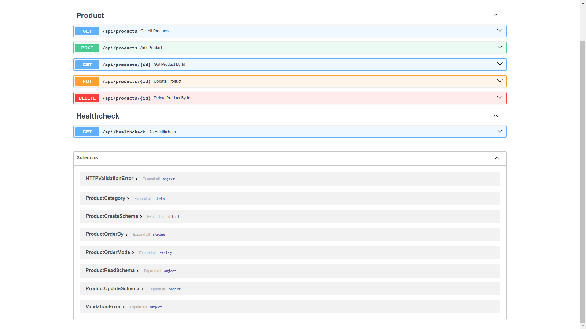
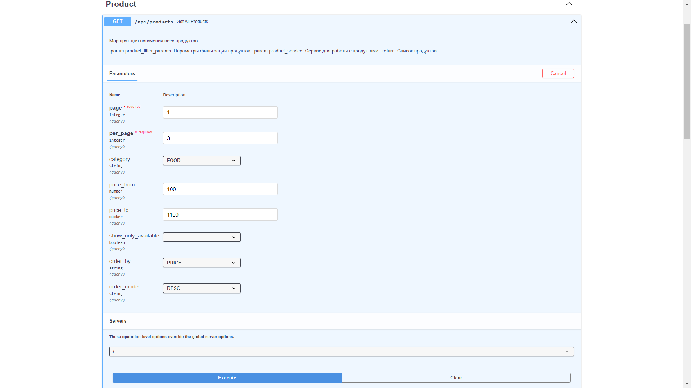
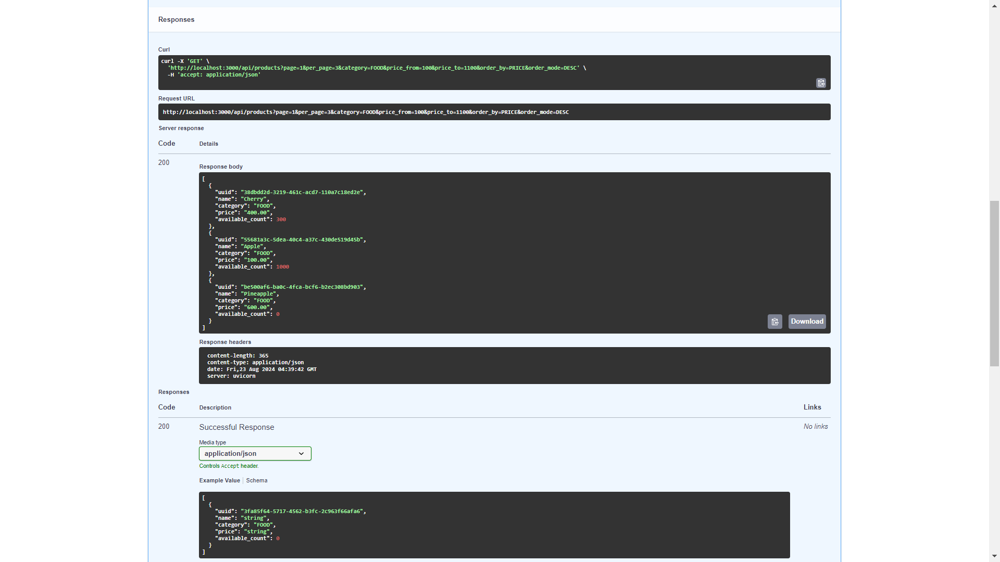

# rest_api_products
Тестовое задание на ***Python-разработчика***

> Приложение предоставляет **REST-API** с CRUD функциями для управления продуктами.
> Приложение реализовывалось с соблюдением принципов **DDD**. 

Использованные технологии:
- REST-API - **FastAPI**
- Хранение данных - **PostgreSQL** + **SQLAlchemy**
- Юнит-тесты - **Pytest**
- Менеджер зависимостей - **Poetry**
- Сборка приложения - **Docker** + **Docker Compose**

## Описание переменных окружения:
- **APP_HOST** - хост, на котором запущен сервер
- **APP_PORT** - порт, на котором запущен сервер
- **POSTGRES_URL** - URL подключения к PostgreSQL в формате `postgresql+asyncpg://<Имя_пользователя>:<Пароль>@<Адрес>:<Порт>/<Имя_БД>`

> Для запуска приложения с помощью Docker Compose необходимо определить дополнительные переменные для PostgreSQL:
- **POSTGRES_USER** - имя пользователя PostgreSQL
- **POSTGRES_PASSWORD** - пароль пользователя PostgreSQL
- **POSTGRES_DB** - имя базы данных PostgreSQL
- **POSTGRES_PORT** - порт PostgreSQL

## Ручной запуск на хостовой машине

1. Установить `Python 3.12`
2. Установить `PostgreSQL 16.0+`
3. Установить зависимости с помощью команды `poetry install --without test`. Для возможности запускать тесты необходимо
выполнить команду `poetry install`
4. Создать файл `.env` с перечисленными переменными окружения. Пример данных указан в файле `.env.default`. 
***! Не использовать в продакшене данные из примера !***
5. Обновить базу данных миграциями с помощью команды `alembic upgrade head`
6. Запустить файл `app/main.py`

## Запуск через Docker Compose

1. Создать файл `.env` с перечисленными переменными окружения
2. Запустить сборку командой `docker compose -f docker-compose.yml up`

## Запуск тестов

Запуск тестов осуществляется командой `pytest -v`

## Пример работы API

